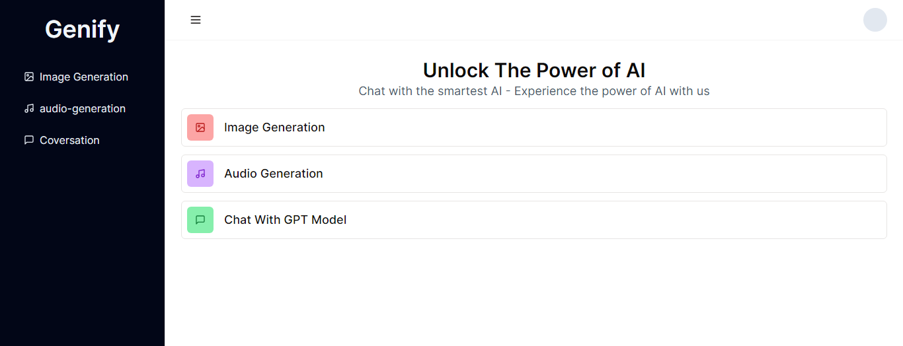

## Convex Hackathon 

a project for participants in the convex hackathon hosted by [WEB DEV Cody](https://www.youtube.com/watch?v=lBR8o1JpSrc&t=1s)

## Preview 


      OPENAI_API_KEY
    

### Technogies used in the project 
- [Convex](https://convex.dev)
- [NextJS](https://nextjs.org/)
- [Replicate](https://replicate.com/)
- [OpenAI CHAT GPT](https://openai.com)

### Setup Convex: 

add Environment Variables in Convex Dashboard 

```.env
REPLICATE="xxxxxxxxxxxxxxx",
OPENAI_API_KEY="xxxxxxxxxxxxxxxx"
```